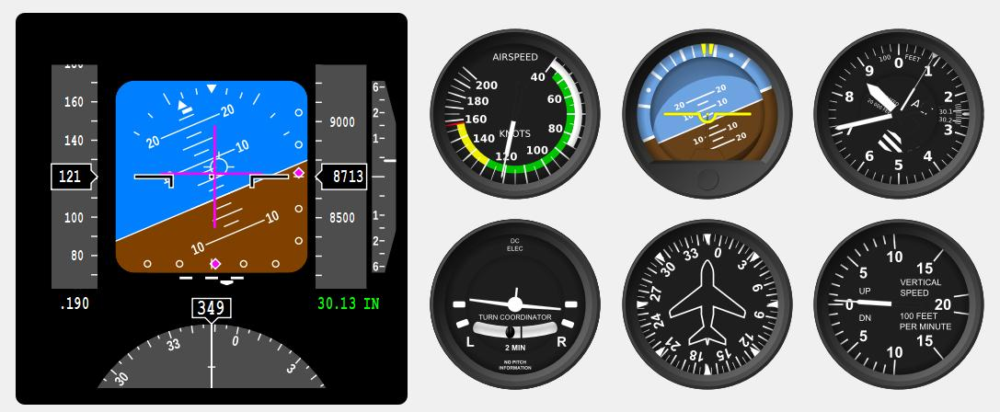

# qfi

This is a repo for the Qt Flight Control Instruments project posted on SourceForge in 2015.  It was named "QFlightInstruments" and can be found here:

https://sourceforge.net/projects/qfi/

The goal is to update this project in two significant ways: 1) revise code and project files to compile with current Qt versions (i.e., version 5.x), and secondly, update code base to adopt more Modern C++ concepts and style.

The first/initial commit is identical to what was downloaded in the 7-Zip archive with the exception of this README.md file.

This package allows you to create nice looking instruments (and a panel or cluster of them) as shown below.

# Status

This project compiles and executes cleanly with Visual Studio 2015, 2017, GCC and Qt 5.10. Much of the code has been revised to minimize header file includes (meaning, max use of forward references), use of 'nullptr', and uniform brace initialization syntax.

